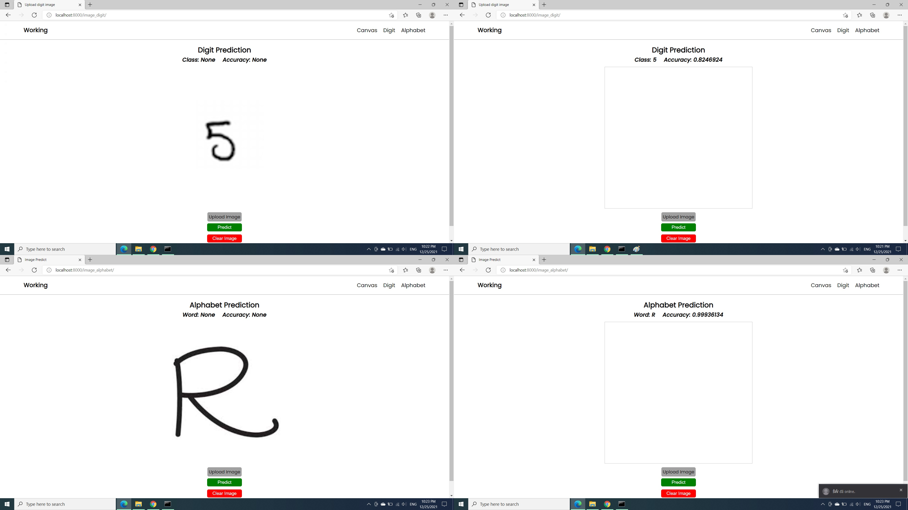

# handwritten_django
A simple CNN (Convolutional Neural Network) predicts images containing handwritten characters
### Setup your enviroment

*After download code, unzip and follow below*

1. **Open cmd or window powershell**
2. **Go to project folder.** Ex: cd ./path/to/handwritten_django-main
3. **Create virtual environment**
- python -m venv env **or** py -m venv env
4. **Run virtual environment**
- .\env\Scripts\activate **or** .\env\Scripts\activate.ps1
5. **Install the necessary python libraries**
- pip install requirements.txt
6. **Run server**
- python manage.py runserver
#### Some images for predicting in the static/images folder. But you can load any image in google for prediction.

